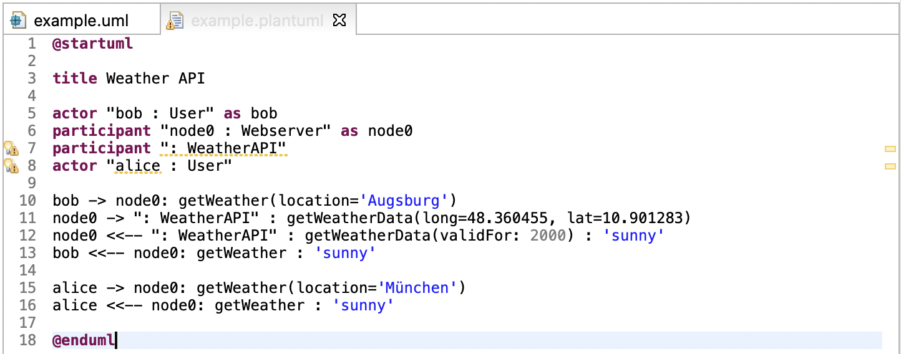
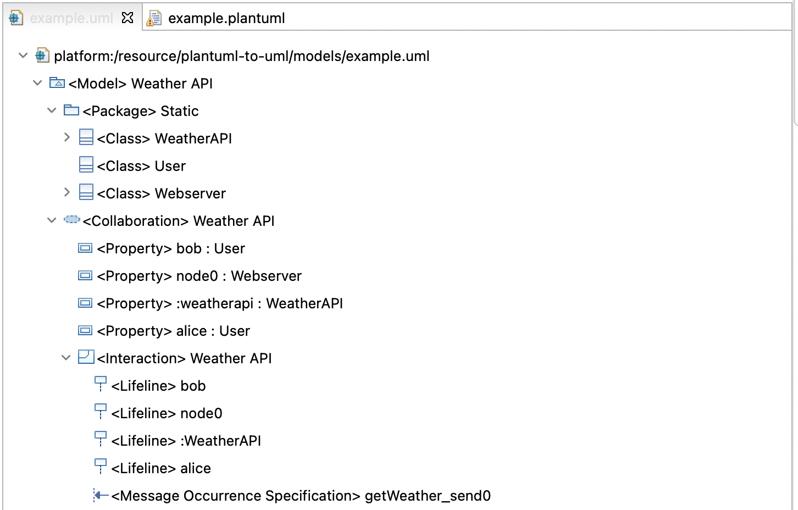

# PlantUML to UML

The goal of this project is to simplify the creation of UML Models using a textual representation. PlantUML offers an iterative way of creating interaction diagrams using simple and forgiving syntax and by providing a graphical representation of the model.

Based on the PlantUML syntax we help users transform the PlantUML source files to UML Models. 

We offer an Eclipse Editor with advanced features like code completion, syntax checking, validations and quickfixes for writing UML compatible PlantUML. We implemented a Domain Specific Language based on PlantUML using XText.

In the second step we transform the PlantUML source files, as instances of the PlantUML metamodel, to a valid UML model using QVT Operational.

The resulting UML Model can be used for a variety of scenarios like code generation, further model transformation and validation.

## Example

### Input

### Output

